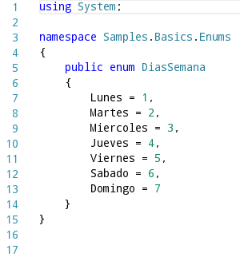
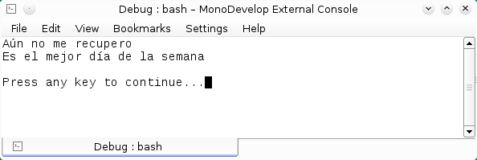

# Enumeraciones con C#
		

Un tipo de datos de enumeración <b>enum</b> es usado para definir un conjunto de elementos constantes, este tipo de datos se usan para agrupar constantes y en programas de opción múltiple.
			Las enumeraciones pueden ser de cualquier tipo de datos <i>(integer, short, long)</i> excepto el tipo de datos <i>char</i>.

			
Un breve ejemplo:

			

			

 
			
Ahora con esta enumeración podemos hacer un programa que tenga el siguiente método.

			
La ejecucción del programa producirá la siguiente salida.

			
<b>Fig 1. La ejecucción del ejemplo de enumeraciones</b>
 
			

			
			

